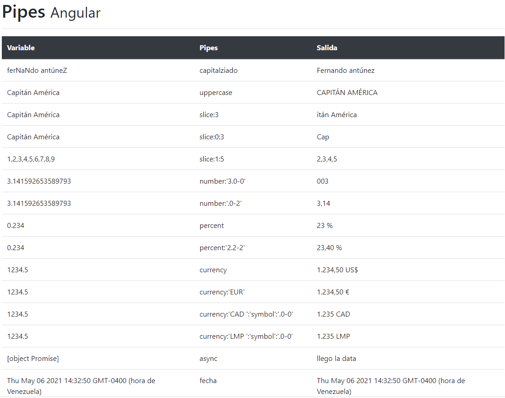

# Angular Pipes
Información general de los pipes de angular y como usarlos




## Herramientas

Para este proyecto se utilizarón las siguientes herramientas

* [Angular Docs](https://angular.io/docs)
* [Node](https://nodejs.org/es/)
* [Bootstrap](https://getbootstrap.com/)

## Development environment

```bash
git clone
cd angular-pipes
npm install
ng serve -o
```

## Autor


[<br /><sub><b>Fernando Antúnez</b></sub>](https://github.com/FJALCode)<br />[💻](https://github.com/FJALCode "Code") [📢](#talk-Meabed "Talks")

## Expresiones de Gratitud
Proyecto basado en curso de [Fernando Herrera](https://github.com/Klerith).